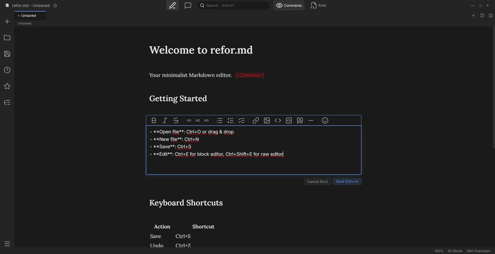

# refor.md

> **Read, Comment, Refine** — A minimalist Markdown editor as a desktop app.

A Markdown editor focused on the essentials: reading, commenting, and refining documents. Built with Electron and vanilla JavaScript.


---

<p align="center">
  
</p>

---

## ✨ Features

- 📝 **Block Editor** — Click on a paragraph to edit it (Ctrl+E)
- 🔧 **Raw Editor** — Full Markdown source editor (Ctrl+Shift+E)
- 💬 **Comments** — HTML comments as inline annotations (Ctrl+K)
- 📑 **Split View** — Edit two documents side by side
- 🗂️ **Tabs** — Open multiple files at once (Ctrl+T)
- 📚 **Table of Contents** — Auto-generated from headings
- 🔍 **Search** — Full-text search with match navigation (Ctrl+F)
- 📤 **Export** — PDF and HTML export
- 🖱️ **Drag & Drop** — Open files and insert images via drag & drop
- 💾 **Auto-Save** — Automatically saves every 30 seconds
- 🔎 **Zoom** — Adjustable font size (Ctrl+Plus/Minus)
- 🌗 **Themes** — Dark and light mode
- ✏️ **Spell Check** — Toggleable via the menu
- ⭐ **Favorites & Recent Files** — Quick access to frequently used files
- 💡 **Syntax Highlighting** — For 15+ programming languages

---

## 📥 Installation

### Quick Install

1. **Download** the latest `refor.md Setup x.x.x.exe` from [Releases](https://github.com/KarloDerBaer/Refor.md/releases)
2. Run the installer and follow the instructions

### From Source

```bash
# Clone the repository
git clone https://github.com/KarloDerBaer/Refor.md.git
cd Refor.md

# Install dependencies
npm install

# Start the development server
npm run dev

# Build the app
npm run build
```

---

## ⌨️ Keyboard Shortcuts

| Action | Shortcut |
|--------|----------|
| Save | Ctrl+S |
| New file | Ctrl+N |
| Open file | Ctrl+O |
| New tab | Ctrl+T |
| Close tab | Ctrl+W |
| Edit mode | Ctrl+E |
| Raw editor | Ctrl+Shift+E |
| Comment mode | Ctrl+K |
| Search | Ctrl+F |
| Bold | Ctrl+B |
| Italic | Ctrl+I |
| Insert link | Ctrl+L |
| Undo | Ctrl+Z |
| Redo | Ctrl+Y |
| Print | Ctrl+P |
| Zoom in | Ctrl+Plus |
| Zoom out | Ctrl+Minus |
| Reset zoom | Ctrl+0 |

---

## 🛠️ Technology

| | Technology | Purpose |
|---|---|---|
| ⚡ | [Electron](https://www.electronjs.org/) | Desktop framework |
| 🔨 | [Vite](https://vitejs.dev/) | Build tool |
| 📄 | [marked](https://marked.js.org/) | Markdown parser |
| 🎨 | [highlight.js](https://highlightjs.org/) | Syntax highlighting |
| 🛡️ | [DOMPurify](https://github.com/cure53/DOMPurify) | HTML sanitization |
| 🖼️ | [Lucide](https://lucide.dev/) | Icons |

---

## 📞 Support

- **Issues:** [GitHub Issues](https://github.com/KarloDerBaer/Refor.md/issues)

---

## Support this Project ☕

I built refor.md because I wanted a clean, distraction-free Markdown editor that just works. If it's useful to you too, I'd really appreciate a coffee! Your support helps keep development going.

[](https://buymeacoffee.com/karloderbaer)

---

**Made with ❤️ for writers, developers, and everyone who loves Markdown**

⭐ **Star this repo if you find it useful!**

---

## 📄 License

This project is licensed under the **Apache License 2.0**.

**You are free to:**
- ✅ **Use** — for any purpose, including commercial
- ✅ **Modify** — create derivative works
- ✅ **Distribute** — share copies freely

**Under the following terms:**
- 📝 **Attribution** — You must give appropriate credit and indicate changes
- 🛡️ **Patent Protection** — Contributors grant patent rights; litigants lose theirs

Full license: [Apache-2.0](LICENSE)
